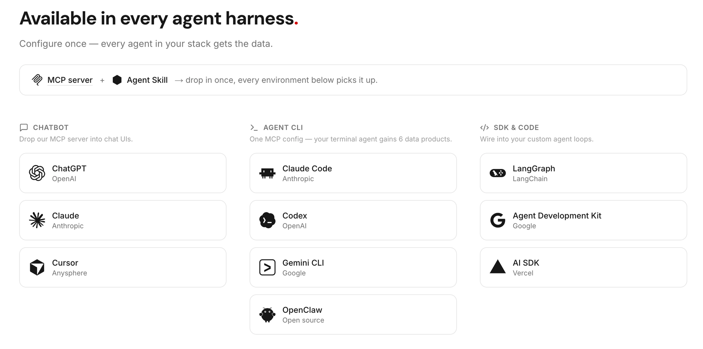
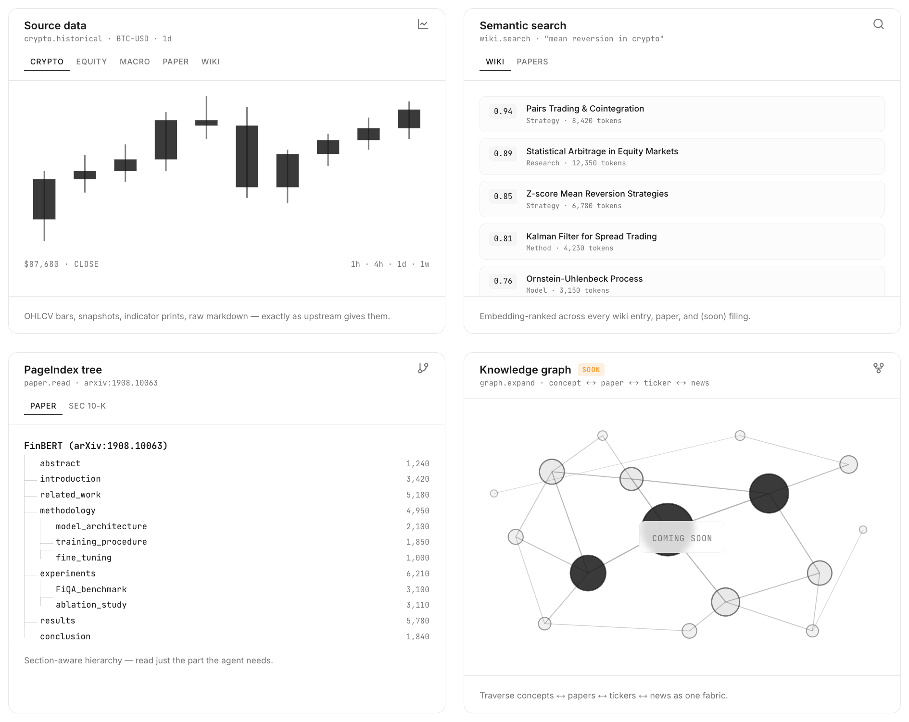
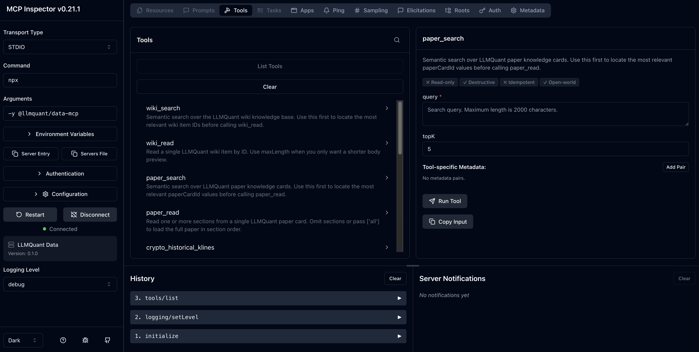

<p align="center">
  <a href="https://llmquantdata.com">
    <picture>
      <source media="(prefers-color-scheme: dark)" srcset="./assets/logo-dark.svg" />
      
    </picture>
  </a>
</p>

<h3 align="center">@llmquant/data-mcp</h3>

<p align="center">
  The knowledge harness for AI‑native finance.<br/>
  <a href="https://llmquantdata.com">官网</a> · <a href="https://docs.llmquantdata.com">文档</a> · <a href="./README.md">English</a>
</p>

<p align="center">
  <a href="https://www.npmjs.com/package/@llmquant/data-mcp"></a>
  <a href="https://www.npmjs.com/package/@llmquant/data-mcp"></a>
  <a href="./LICENSE"></a>
  <a href="https://nodejs.org"></a>
</p>

---

金融数据，为 agent context 而生 — 不是给人看的，是给 agent 用的。

## 目录

- [这是什么](#这是什么)
- [可用工具](#可用工具)
- [试一试](#试一试)
- [一键安装（Prompt）](#一键安装prompt)
- [接入方式](#接入方式)
- [Remote / Hosted MCP](#remote--hosted-mcp)
- [环境变量](#环境变量)
- [路线图](#路线图)
- [另请参阅](#另请参阅)
- [贡献](#贡献)
- [License](#license)

## 这是什么

[LLMQuant Data](https://llmquantdata.com) 的 MCP server。通过 [Model Context Protocol](https://modelcontextprotocol.io) 把金融数据（百科、论文、行情、预测市场、宏观指标、SEC 财报等）接入任何 AI agent。

配置一次，所有 agent 环境直接可用。

<p align="center">
  
</p>

> [!TIP]
> 我们还在做 **llmquantdata-skills** — 把这些数据工具串成现成的金融工作流（个股研究、宏观分析等），开箱即用。

## 可用工具

> [!NOTE]
> Credit 计费目前处于 **beta**，下表额度可能调整。在 [llmquantdata.com](https://llmquantdata.com) 注册即送免费 credits，不用绑卡。

| 工具 | 说明 | Credit |
|------|------|--------|
| `wiki_search` | 语义搜索 50,000+ 量化百科词条 | 1 |
| `wiki_read` | 按 ID 读取百科词条 | 0 |
| `paper_search` | 语义搜索 1,200+ 研究论文 | 1 |
| `paper_read` | 按章节读取论文（摘要、方法、结论等） | 0 |
| `crypto_historical_klines` | 加密货币历史 K 线 | 1 |
| `crypto_snapshot` | 加密货币实时价格 + 24h 统计 | 1 |
| `polymarket_event_browse` | 按关键词、状态、标签、资产、成交量和流动性列举或精确筛选金融范围内的预测市场事件 | 1 |
| `polymarket_event_search` | 语义搜索金融范围内的预测市场事件 | 2 |
| `polymarket_event_read` | 读取一个预测市场事件卡片和它下面的 market 预览 | 0 |
| `polymarket_market_read` | 读取一个预测市场 market 卡片、outcomes 和 outcome token ids | 0 |
| `polymarket_price_history` | 查询一个 outcome token 的小时或日度隐含概率历史 | 0 |
| `equity_historical_prices` | 美股日线 OHLCV + 分红/拆股 | 1 |
| `equity_intraday_prices` | 美股 `1h` 常规交易时段 OHLCV bars | 1 |
| `etf_lookup` | ETF 基本信息 + SEC 映射 + top holdings 摘要（当前支持的 ETF 范围） | 0 |
| `etf_holdings` | ETF 最近可用 SEC N-PORT 监管持仓（当前支持的 ETF 范围） | 1* |
| `macro_indicator_search` | 浏览 50+ 精选宏观指标 | 0 |
| `macro_indicator_history` | 查询宏观指标历史数据 | 1 |
| `macro_indicator_snapshot` | 获取宏观指标最新值 | 1 |
| `sec_filing_browse` | 浏览 SEC 10-K / 10-Q / 8-K 财报元数据（每条带 `sectionKeys` = 可读的章节 code） | 0 |
| `sec_filing_read` | 读取 SEC 财报章节正文；传 `items` 一次取多段、省略则取全部（8-K 需先 browse 拿 `accession_number`） | 1 |
| `sec_13f_list_manager_holdings` | 列出某机构最新季度 13F 持仓（covered manager set × 至少最近 4 季度） | 1 |
| `sec_13f_list_ticker_holders` | 列出持有某 ticker 的机构（covered manager set × 至少最近 4 季度） | 1 |
| `sec_13f_list_top_managers` | 按 13F reportable value 列出 Top N smart money 机构（最新季度，最多 1000） | 1 |
| `personal_holdings` | 读取你在 LLMQuant Dashboard → Profile 保存的持仓（仅限你自己的账号） | 0 |
| `personal_profile` | 读取你在 LLMQuant Dashboard → Profile 保存的财务背景（仅限你自己的账号） | 0 |

预测市场工具按 event-first 流程使用：自然语言发现优先用 `polymarket_event_search`，只有 list / exact-filter 请求才用 `polymarket_event_browse`；再读选中的 event，继续读 market，最后用 outcome token 查概率历史。

> 更多数据（公司基本面、earnings call 等）见[路线图](#路线图)。

每种数据支持四种查询方式：

<p align="center">
  
</p>

## 试一试

用 [MCP Inspector](https://modelcontextprotocol.io/docs/tools/inspector) 在浏览器里交互测试：

```bash
export LLMQUANT_API_KEY=your_api_key
npx @modelcontextprotocol/inspector npx -y @llmquant/data-mcp
```

> [!NOTE]
> 想持久化 key，把 `export LLMQUANT_API_KEY=your_api_key` 加到 `~/.zshrc` 或 `~/.bashrc`。

<p align="center">
  
</p>

> [!TIP]
> 需要 API key — 在 [llmquantdata.com](https://llmquantdata.com) 免费注册。

## 一键安装（Prompt）

最快的方式：把下面这段 prompt 丢进 Claude Code / Cursor / Codex CLI / Gemini CLI / 任意支持 MCP 的 agent。Agent 会读这份 README 然后按它当前 runtime 的配置跑安装。

```text
Install the LLMQuant data-mcp server in this environment by following https://github.com/LLMQuant/data-mcp
```

> [!TIP]
> 确保 agent 运行的 shell 里已经 `export LLMQUANT_API_KEY=...`。免费 key 在 [llmquantdata.com](https://llmquantdata.com) 注册即得。

更想手动配置？看下面的 [接入方式](#接入方式)。

## 接入方式

### Claude Code

```bash
claude mcp add llmquant-data \
  -e LLMQUANT_API_KEY=your_api_key \
  -- npx -y @llmquant/data-mcp
```

### Cursor

写入 `.cursor/mcp.json`（项目级）或 `~/.cursor/mcp.json`（全局）：

```json
{
  "mcpServers": {
    "llmquant-data": {
      "command": "npx",
      "args": ["-y", "@llmquant/data-mcp"],
      "env": {
        "LLMQUANT_API_KEY": "your_api_key"
      }
    }
  }
}
```

### Codex CLI

```bash
codex mcp add llmquant-data \
  --env LLMQUANT_API_KEY=your_api_key \
  -- npx -y @llmquant/data-mcp
```

### Gemini CLI

```bash
gemini mcp add -s user \
  -e LLMQUANT_API_KEY=your_api_key \
  llmquant-data \
  npx -y @llmquant/data-mcp
```

### 其他 MCP 客户端

支持 stdio 的客户端都能用这段配置：

```json
{
  "mcpServers": {
    "llmquant-data": {
      "command": "npx",
      "args": ["-y", "@llmquant/data-mcp"],
      "env": {
        "LLMQUANT_API_KEY": "your_api_key"
      }
    }
  }
}
```

> [!NOTE]
> 更多客户端的接入指南在补充中。你用的框架没列出来？[提个 Issue](https://github.com/LLMQuant/data-mcp/issues)，我们来加。

## Remote / Hosted MCP

`@llmquant/data-mcp` 本地仍默认走 stdio。登录后的 LLMQuant 用户也可以在 Dashboard 里生成 hosted Remote MCP connector URL；适合支持远程 connector、且不想在本地运行 Node.js 进程的 MCP 客户端。

### Claude custom connectors

在 LLMQuant Dashboard 的 **Connect** 里生成 Remote MCP URL：

```text
https://mcp.llmquantdata.com/u/lqd_mcp_.../mcp
```

把完整 URL 粘到 Claude custom connector。Hosted URL 和本地 `LLMQUANT_API_KEY` 是分开的，可以在 Dashboard 里单独 revoke。

> [!IMPORTANT]
> 请把 hosted connector URL 当作密码保存。任何拿到 URL 的人都可以使用这个 connector，直到你 revoke 它。

## 环境变量

| 变量 | 必填 | 默认值 | 说明 |
|------|------|--------|------|
| `LLMQUANT_API_KEY` | stdio 必填 | — | 本地 stdio 模式用的用户 API key |
| `LLMQUANT_BASE_URL` | 否 | `https://api.llmquantdata.com` | API 地址 |
| `LLMQUANT_API_TIMEOUT_MS` | 否 | `15000` | 请求超时，毫秒（最大 120000） |

## 路线图

- [x] Streamable HTTP transport（不装 Node.js 也能远程用）
- [ ] Claude Connectors Directory OAuth 流程
- [ ] 更多数据 — 公司基本面、earnings call
- [ ] Agent skills 配套包（**llmquantdata-skills**）
- [ ] 更多 agent 框架接入指南

有想法？[提 Issue](https://github.com/LLMQuant/data-mcp/issues) 或邮件 **contact@llmquant.com**。

## 另请参阅

- **[Awesome Trading Agents](https://github.com/LLMQuant/awesome-trading-agents)** —— 社区维护的 agent recipe 集合，把 `data-mcp` 工具串成端到端研究工作流（个股研究、宏观简报、smart money 追踪等）。
- **[文档](https://docs.llmquantdata.com)** —— 完整 API 参考、MCP 接入指南、credit policy。

## 贡献

本仓库是**只读镜像**，不接受 PR。

发现问题或有建议？直接 [开 Issue](https://github.com/LLMQuant/data-mcp/issues)。

## License

[MIT](./LICENSE)
